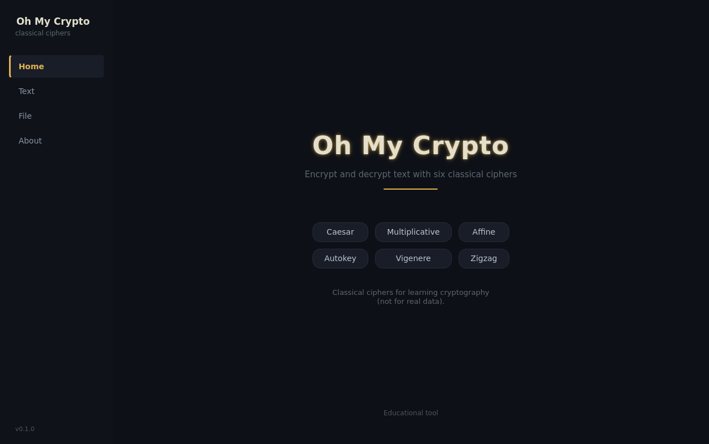

# Oh My Crypto

<p align="center">
  
</p>

A desktop GUI crypto utility written in **Zig 0.16.0** with **Qt 6** bindings via
[`libqt6zig`](https://github.com/rcalixte/libqt6zig). Encrypt, decrypt and hash
text with three categories of algorithms:

- **11 classical ciphers** — for learning cryptography
- **11 modern AEAD ciphers** — keyed from a password via Argon2id, PBKDF2 or scrypt
- **16 hash algorithms** — SHA-1/2/3, SHAKE, BLAKE2/BLAKE3, MD5

## Classical ciphers

| Cipher                | Transformation                              | Key            |
| --------------------- | ------------------------------------------- | -------------- |
| Caesar                | `E(x) = (x + k) mod 26`                     | shift `k`      |
| Multiplicative        | `E(x) = (k · x) mod 26`                     | key `k`        |
| Affine                | `E(x) = (a · x + b) mod 26`                 | `(a, b)`       |
| Autokey               | key stream = keyword + running plaintext    | keyword        |
| Vigenère              | key stream = keyword, repeated cyclically   | keyword        |
| Zigzag                | letters rearranged in a rail-fence pattern  | rails `r`      |
| Atbash                | `E(x) = (25 − x) mod 26` (A↔Z, B↔Y, …)      | —              |
| Rot13                 | Caesar with `k = 13` (self-inverse)         | —              |
| Beaufort              | `E(x) = (k − x) mod 26`                     | keyword        |
| Columnar Transposition| letters written in rows, read by keyed columns | keyword    |
| Bifid                 | Polybius square + fractionation             | keyword        |

> **Educational tool.** The classical ciphers are trivially breakable with modern
> frequency analysis. Use them to learn cryptography, not to protect data.

## Modern AEAD encryption

The modern category uses authenticated encryption with associated data. A password
is stretched into a 256-bit key with one of three KDFs:

| KDF             | Key derivation                                  |
| --------------- | ----------------------------------------------- |
| Argon2id        | memory-hard, winner of the Password Hashing Competition |
| PBKDF2-SHA256   | 210 000 rounds by default                       |
| scrypt          | memory-hard (OWASP parameters by default)       |

Encrypted output is a single self-describing container: magic, version, KDF and
AEAD ids, KDF cost parameters, a random salt, a random nonce, the ciphertext and
an authentication tag. Decryption re-derives the key from the same password and
verifies the tag, so tampering or a wrong password is detected.

| AEAD                    | Nonce | Notes                                |
| ----------------------- | ----- | ------------------------------------ |
| XChaCha20-Poly1305      | 24    | default — large nonce, safe random  |
| ChaCha20-Poly1305       | 12    | RFC 8439                             |
| XChaCha12-Poly1305      | 24    | reduced-round variant                |
| ChaCha12-Poly1305       | 12    | reduced-round variant                |
| AES-256-GCM             | 12    | hardware accelerated on most CPUs    |
| AES-128-GCM             | 12    |                                      |
| AES-256-GCM-SIV         | 12    | nonce-misuse resistant               |
| AES-128-GCM-SIV         | 12    | nonce-misuse resistant               |
| AEGIS-256               | 32    | high-throughput (AES-based)          |
| AEGIS-128L              | 32    | high-throughput (AES-based)          |
| XSalsa20-Poly1305       | 24    | libsodium-compatible                 |

## Hash algorithms

| Family   | Algorithms                                                            |
| -------- | --------------------------------------------------------------------- |
| MD5      | MD5 (legacy, collisions known)                                        |
| SHA-1    | SHA-1 (legacy, collisions known)                                      |
| SHA-2    | SHA-224, SHA-256, SHA-384, SHA-512, SHA-512/256                       |
| SHA-3    | SHA3-224, SHA3-256, SHA3-384, SHA3-512, SHAKE128, SHAKE256            |
| BLAKE    | BLAKE2s-256, BLAKE2b-512, BLAKE3                                      |

Hashes are shown as lowercase hex. SHAKE128/256 are variable-length XOFs; here they
emit 256-bit outputs.

## Features

- Qt 6 native GUI (widgets) — no web view, no Tkinter
- Sidebar navigation across four pages: Home, Text, File, About
- **Home page** — hero title with a subtle glowing accent, algorithm chips, and a muted educational note
- **Text page** — category combo (`Classical` / `Modern` / `Hash`) switches the algorithm list and the key inputs:
  - *Classical* — per-cipher key inputs:
    - shift spinbox 0–25 (Caesar)
    - key spinbox 0–25, auto-validated against `gcd(k, 26) = 1` (multiplicative)
    - `a` and `b` spinboxes, `a` auto-validated (affine)
    - keyword line edit (autokey, Vigenère, Beaufort, columnar, Bifid)
    - rails spinbox 2–10 (zigzag)
  - *Modern* — password line edit (masked) + KDF combo (Argon2id / PBKDF2-SHA256 / scrypt)
  - *Hash* — Hash button instead of Encrypt/Decrypt; result is a hex digest
- **File page** — open a `.txt` file with a native dialog, encrypt, decrypt or hash
  its content, and save the result to a new file
- Substitution ciphers preserve spaces, digits, and punctuation; only
  `A–Z` / `a–z` are transformed. Transposition ciphers permute letters only and
  keep non-letter characters in place.
- Case preserved per letter
- Copy/paste friendly plain text areas
- Dark and light themes (Ayu), persisted across runs and matched to the system scheme
- Invalid keys and other errors reported in the status line and message dialogs

## Internationalization

The UI is translated with Qt's `QTranslator` + `.qm` catalogs. English (`en`),
Arabic (`ar`) and Spanish (`es`) ship out of the box. The active language is
persisted in `QSettings` and remembered on the next start; switching language in
the sidebar combo rebuilds the UI in place. Arabic enables right-to-left layout
and loads the Rubik font with Arabic glyph coverage.

- `src/i18n.zig` — language enum, `tr()` helper, `setLanguage`, RTL + translator wiring
- `src/i18n/omc_<lang>.ts` — XML translation source (author this)
- `src/i18n/omc_<lang>.qm` — compiled catalog, regenerated by `lrelease` during the build
- UI labels go through `tr("...")`; a missing translation falls back to English

### Adding a language

1. Copy `src/i18n/omc_es.ts` to `src/i18n/omc_<lang>.ts` and translate the `<source>` texts.
2. Add the language to the `Language` enum in `src/i18n.zig` (English locale code, e.g. `.fr` for French) and to the `codes` array used for the `.ts`/`.qm` file names.
3. Add a `tr("LanguageName")` entry to every `.ts` — it drives the sidebar combo label.
4. Ensure the chosen UI font has glyphs for the script (e.g. Arabic needs a font like Rubik loaded in `main.zig`).
5. Rebuild — `lrelease` regenerates the `.qm` and the embed step links it in.


## Requirements

- Zig **0.16.0** (latest stable)
- Qt **6.8+** development files.
- C and C++ toolchain (`gcc` / `clang`, `libstdc++`)

## Build

```bash
zig build            # build binary into zig-out/bin
zig build run        # build and run
zig build test       # run cipher + modern algorithm unit tests
zig build -Doptimize=ReleaseSafe   # release build
```

The binary is written to `zig-out/bin/omc`.

Dependencies are declared in `build.zig.zon` and fetched automatically. The
first build compiles the linked subset of `libqt6zig` — expect a few minutes on
a cold cache; subsequent builds take seconds.

## Project layout

```
build.zig          # build script: Qt module wiring + artifact links
build.zig.zon      # dependency manifest (libqt6zig pinned) + app metadata
src/
  main.zig         # Qt application entry point, window shell + font loading
  root.zig         # library module root (exports cipher + modern modules)
  cipher.zig       # 11 classical ciphers (encrypt/decrypt + tests)
  modern.zig       # modern AEAD, KDFs and hashes (encrypt/decrypt/hash + tests)
  pages.zig        # GUI pages, widget state, and signal callbacks
  sidebar.zig      # sidebar navigation (Home / Text / File / About) + language combo
  theme.zig        # dark/light theme switching + persistence
  i18n.zig         # tr(), language switching, RTL, QTranslator wiring
  i18n/            # translation sources (.ts) and compiled catalogs (.qm)
  style.zig        # embeds the QSS stylesheets
  themes/          # ayu_dark.qss, ayu_light.qss
  assets/          # embedded Rubik font (assets/fonts.zig)
```

## License

MIT — see [LICENSE](LICENSE).

Qt is licensed separately (LGPL/GPL/commercial) — meet your obligations under
[Qt licensing](https://doc.qt.io/qt-6/licensing.html).
